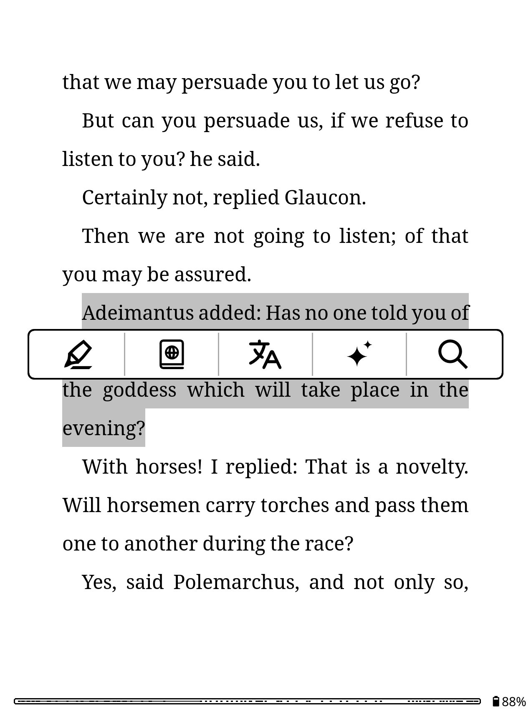
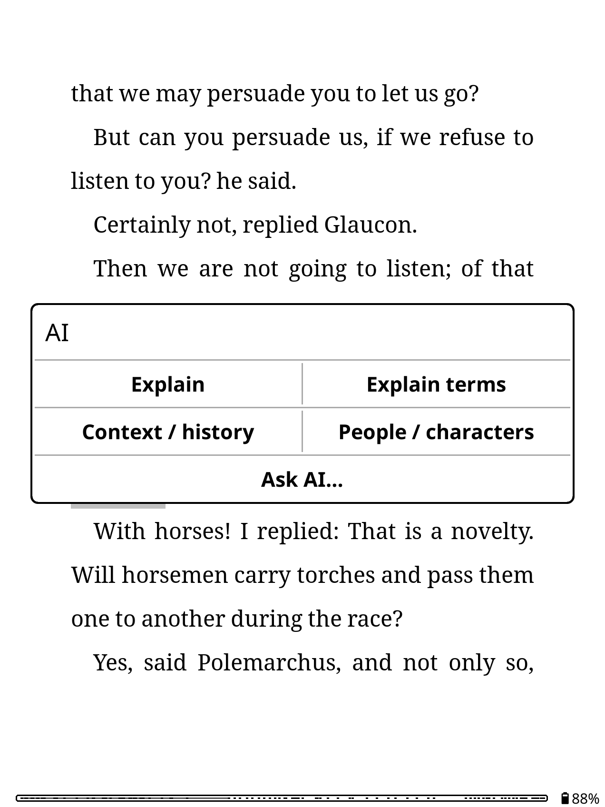
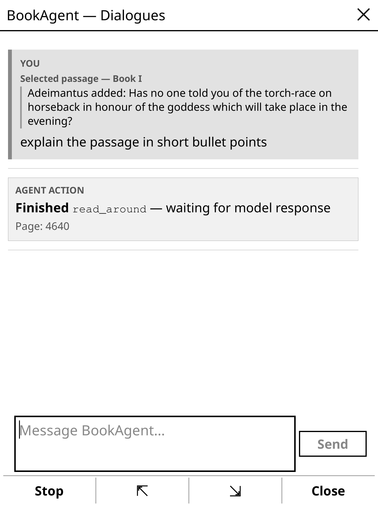
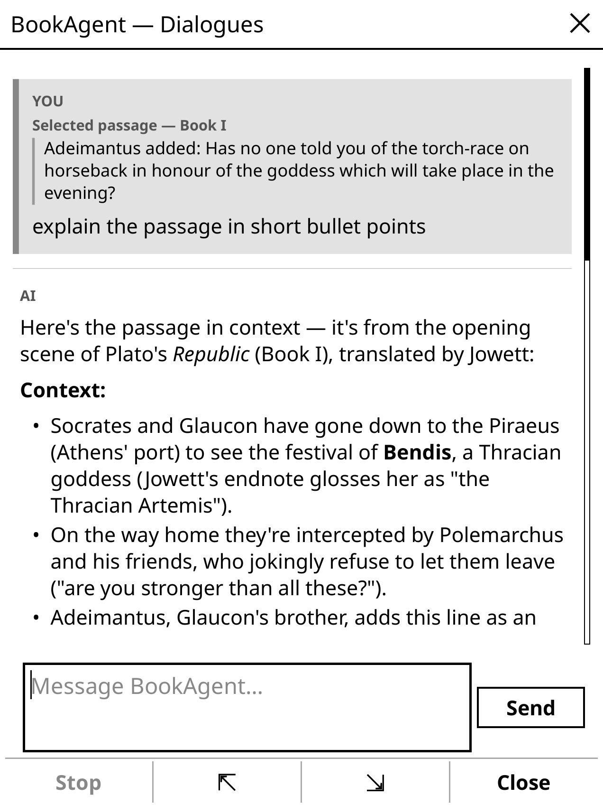

# Insightful for KOReader

Insightful is a simple, lightweight AI reading harness for KOReader. Instead of putting the whole book into every prompt, it gives the LLM five specific ways to read the book you have open.

Ask who Adeimantus is, for example. The LLM can search for his name and read the passages around a few matches. It can then answer from those passages. If it needs more context, it can search again. Each lookup appears on screen as an **AGENT ACTION**, so you can see which parts of the book went into the answer.

Insightful keeps this job narrow. Here is how it compares with two broader KOReader AI plugins.

| Plugin | Main design | Local book tools | Web search | Wider features |
| --- | --- | --- | --- | --- |
| Insightful | A small reading harness with one conversation for each book | Five tools that the model can call | No | Focused on the open book and the current conversation |
| [KOAssistant](https://github.com/zeeyado/koassistant.koplugin) | A full AI reading suite | Three book tools with automatic and manual modes | Yes | X-Ray, summaries, recap, library tools, artifacts, and more |
| [Assistant](https://github.com/omer-faruq/assistant.koplugin) | A general AI helper for selected text and book actions | No model-directed local book tool loop | Yes | Translation, dictionary, Term X-Ray, recap, custom prompts, and more |

<table>
  <tr>
    <td align="center" width="50%">
      <br>
      <sub>Select a passage</sub>
    </td>
    <td align="center" width="50%">
      <br>
      <sub>Choose an action or ask a question</sub>
    </td>
  </tr>
  <tr>
    <td align="center" width="50%">
      <br>
      <sub>See which part of the book the LLM reads</sub>
    </td>
    <td align="center" width="50%">
      <br>
      <sub>Keep one conversation for each book</sub>
    </td>
  </tr>
</table>

Insightful works with OpenAI, DeepSeek, OpenRouter, and Anthropic. It does not build an index, create embeddings, or run jobs in the background. Each book gets one conversation that you can close and return to later.

## Install

1. Copy this directory to `koreader/plugins/insightful.koplugin` on the device.
2. Copy `configuration.lua.sample` to `configuration.lua`.
3. Add your provider, endpoint, model, and API key to `configuration.lua`.
4. Restart KOReader and open a book.

You should now see **Insightful** in the reader menu. Select some text and **AI** should also appear in the highlight menu.

`configuration.lua` contains your API key, so keep it private. Git already ignores it.

## Configure the provider

Most people only need to change four values in `configuration.lua`. Pick a provider and copy its endpoint from the table. Then enter a model name and add the API key.

| `provider` | Endpoint | API |
| --- | --- | --- |
| `openai` | `https://api.openai.com/v1/chat/completions` | OpenAI Chat Completions |
| `deepseek` | `https://api.deepseek.com/chat/completions` | DeepSeek Chat Completions |
| `openrouter` | `https://openrouter.ai/api/v1/chat/completions` | OpenRouter Chat Completions |
| `anthropic` | `https://api.anthropic.com/v1/messages` | Anthropic Messages |

Here is a small OpenAI configuration.

```lua
return {
    provider = "openai",
    base_url = "https://api.openai.com/v1/chat/completions",
    model = "gpt-4.1-mini",
    api_key = "YOUR_API_KEY",
    stream = true,
    verify_ssl = true,
}
```

The sample configuration includes the less common settings, such as timeouts, extra request fields, and HTTP headers. Insightful leaves the output token limit and temperature unset for OpenAI, DeepSeek, and OpenRouter unless you choose values yourself. Anthropic requires `max_tokens`, so Insightful uses `8192` when you leave it out.

## Read with Insightful

Select a passage and tap **AI**. Under Zen UI, this is the sparkle icon. The menu gives you a few useful shortcuts. **Explain** deals with the passage as a whole, while **Explain terms** focuses on its vocabulary. Use **Context / history** for the setting or ideas behind a passage. Use **People / characters** when you need to know who someone is.

Choose **Ask AI…** when you want to write the question yourself. The conversation opens with the keyboard closed. Tap **Message Insightful…** to start typing. The message field stays above the keyboard, and a tap in the conversation closes the keyboard again.

The four shortcuts send their questions immediately. They do not create separate chats. Open **Insightful** from the reader menu whenever you want to continue the conversation for the current book.

## See what the model reads

After you send a question, the provider can start writing an answer or ask Insightful to read something. Provider code cannot call KOReader directly. It can only ask for one of the five functions below.

Insightful checks the request and runs the function against the open document. It then returns a limited amount of text to the provider. The provider can ask for another function or finish the answer.

```text
model → tool request → Insightful → open document → limited result → model
```

| Function | What Insightful does |
| --- | --- |
| `search_book` | Searches the open book for one or more phrases and returns a limited number of matches. |
| `read_around` | Reads a short section around a page, location, search match, or internal link. |
| `list_links` | Lists links on the current page or near another location. |
| `toc` | Reads the table of contents. |
| `current_position` | Reports your current reading position. |

A request often goes from `search_book` to `read_around` and then to the answer. The model may stop sooner or make another call, but Insightful limits how much it can read in one request.

The **AGENT ACTION** block is a record of calls that Insightful actually ran. You see the function name and the useful argument for that call. A search shows its query. A read shows the page, match, link, or location. Private reasoning from the provider stays hidden.

`list_links` starts on the current page unless the model gives it another location. Internal links get temporary IDs so `read_around` can follow them. External URLs are shown but never opened. When Insightful moves through a reflowable document to inspect another location, it returns you to the place where you were reading.

## Conversations and privacy

Your turns appear in gray blocks marked **YOU**, with model replies under **AI**. Replies can contain headings, lists, links, quotes, code blocks, and tables. Text arrives in short batches instead of making the Kindle wait for the complete answer.

Insightful saves the conversation in KOReader's settings directory.

```text
insightful/conversations/<book-id>.lua
```

KOReader's stored partial checksum is normally used as the book ID. Insightful saves your questions and the model's replies. Text fetched by a book function is kept only for the active request and is not copied into the conversation file.

The provider may receive the passage you selected, your question, earlier conversation turns, and text returned by a book function. Insightful never uploads the full book on its own.

## Zen UI

Turn on **AI assistant** in Zen UI's highlight settings. Insightful uses this slot so the sparkle icon stays in Zen UI's custom highlight menu.

## Development

Run the checks from the plugin directory.

```sh
./scripts/test.sh
```

The script runs the same tests under LuaJIT and Lua, then parses every Lua file. The tests cover the agent loop, tool limits, provider formats, streaming, storage, links, and conversation rendering. They do not test the final screen layout or a live network request on a Kindle.

Insightful uses Semantic Versioning and Conventional Commit prefixes. Use `./scripts/bump-version.sh patch`, `minor`, or `major` to update `VERSION` and `_meta.lua` together. A `vX.Y.Z` tag runs the checks and creates a ZenPM compatible GitHub release ZIP. See [RELEASING.md](RELEASING.md) for the complete release steps.

## License and notice

Insightful is licensed under the [GNU General Public License version 3](LICENSE). See [NOTICE](NOTICE) for copyright and related project credits.
